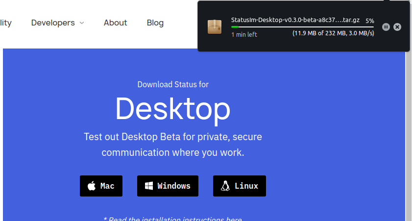
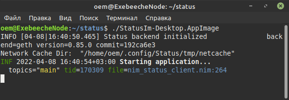
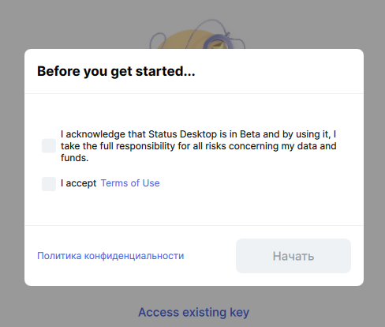
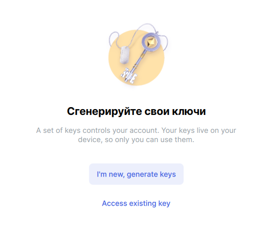
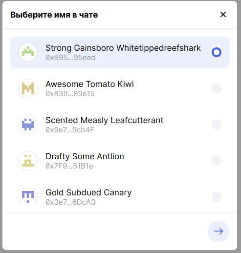
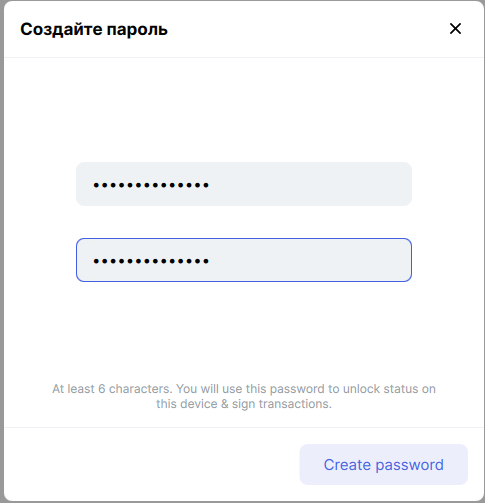
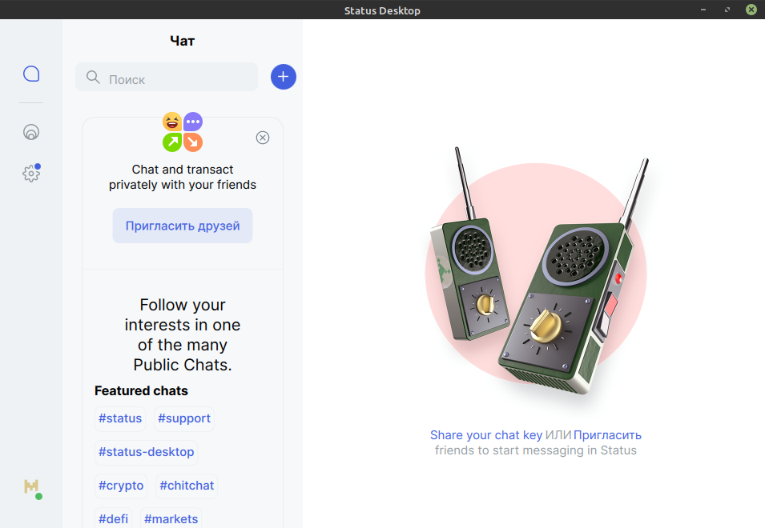

# Status installation

Status is a secure messaging app, crypto wallet, and Web3 browser built with state-of-the-art technology. You can download it from the first page of the [Status portal](https://status.im).

Follow these actions to install the Status app.

## Linux installation

### Step 1

Click **Get Status** for downloading your version of the app on the [Status portal](https://status.im).

### Step 2

Click the Linux operation system icon on the Desktop part of the page. The download will start immediately via the tools of your browser. By default, any browser stores all downloads in the **Download** directory. If you have changed this directory, check it to find the installation archive.

### Step 3

Unpack the downloaded archive to a directory, which you will use as the Status working location.

### Step 4

Open the Terminal using the Status working directory. Execute this command:

    ./StatusIm-Desktop-*.AppImage

You can rename the AppImage file for more simple usage. After the AppImage command, the Status app starts:

### Step 5

After the start, you see the entry screen:

Before checking the boxes, please, read the Terms of Use. Then press **Start**.

### Step 6

You can use your existing key or generate a new one.

#### Generate keys

Choose **I'm new, generate keys**, if you don't have a key and choose a name for the chat:

#### Create a password

Then create a password:

#### Entering

Congrats! Now you can use the Status app:

